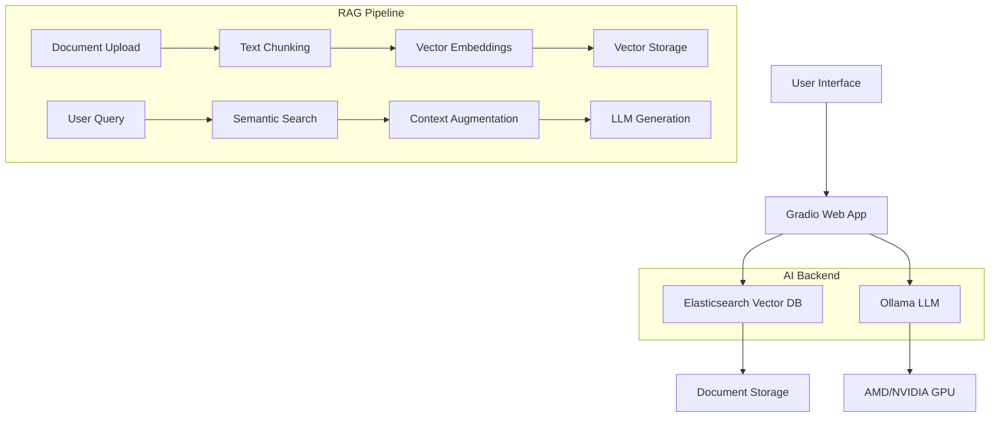

# 📚 Personal RAG Assistant

A powerful, self-hosted Retrieval-Augmented Generation (RAG) application that lets you chat with your personal documents using local AI. Built with GPU support for both AMD and NVIDIA systems.


## ✨ Features

- **🔍 Document Intelligence**: Upload and chat with your TXT files and Markdown documents
- **💬 Smart Conversations**: Context-aware chat using Retrieval-Augmented Generation (RAG)
- **⚡ Local & Private**: Everything runs on your machine - no data leaves your system
- **🎯 Multi-GPU Support**: Optimized for both AMD (ROCm) and NVIDIA (CUDA) GPUs
- **📊 Document Search**: Direct semantic search through your uploaded documents
- **🔧 Easy Setup**: Docker-based deployment with auto-detection for your hardware
- **📈 Real-time Streaming**: Watch responses generate token-by-token
- **🔍 Vector Search**: Semantic search powered by Elasticsearch's dense vector capabilities

## 🏗️ Architecture



## 📋 Prerequisites

- **Docker** and **Docker Compose**
- **GPU** (Optional but recommended):
  - AMD GPU with ROCm support (RX 6000+ series recommended)
  - NVIDIA GPU with CUDA support (GTX 10-series+ recommended)
  - CPU-only mode also supported

## 🚀 Quick Start

### 1. Clone the Repository
```bash
git clone https://github.com/yourusername/personal-rag-assistant.git
cd personal-rag-assistant
```

### 2. Auto-Detect Setup (Recommended)
```bash
# The script automatically detects your GPU and configures accordingly
./start.sh
```

### 3. Manual Setup (If you need specific control)
```bash
# For AMD GPUs
./start.sh amd

# For NVIDIA GPUs
./start.sh nvidia
```

### 4. Access the Application
- **Main App**: http://localhost:7860
- **Elasticsearch**: http://localhost:9200
- **Kibana** (Monitoring): http://localhost:5601
- **Ollama API**: http://localhost:11434

## 📁 Project Structure

```
personal-rag-assistant/
├── src/main.py                 # Main Gradio web interface
├── src/embeddings           # Text embedding utilities (nomic-embed-text)
├── src/storage              # Vector database operations (Elasticsearch, etc.)
├── src/llm                  # LLM chat and RAG functionality (llama2:7b)
├── docker-compose.amd.yml  # AMD GPU configuration
├── docker-compose.nvidia.yml # NVIDIA GPU configuration
├── start.sh                # Auto-detecting startup script
├── stop.sh                 # Stop all services
├── setup-elasticsearch.sh  # Elasticsearch initialization
└── install-rocm.sh  # Setup ROCM for AMD GPUs locally
```

## 🔧 Core Components

### Main Application (`main.py`)
- Gradio-based web interface with three tabs: Chat, Upload Documents, Document Search
- Real-time streaming responses
- Configurable context chunks (1-5)
- File upload support for .txt, .pdf, .md files

### Vector Storage (`elasticsearch`)
- Elasticsearch 8.13.0 with vector search capabilities
- Automatic text chunking with configurable overlap
- Cosine similarity search for semantic retrieval
- Document indexing and management

### LLM Integration (`llm`)
- Ollama integration with streaming support
- RAG pipeline with context augmentation
- Configurable chat models (default: llama2:7b)

### Embeddings (`embeddings`)
- Local embedding generation using nomic-embed-text
- 768-dimensional vector embeddings
- Error handling and fallback mechanisms

## 💻 Usage

### 1. Upload Documents
- Go to the "Upload Documents" tab
- Upload your TXT or Markdown files
- Documents are automatically chunked and indexed for semantic search

### 2. Chat with Your Documents
- Switch to the "Chat" tab
- Ask questions about your uploaded content
- Adjust the "Context chunks" slider (1-5) to control how much context is used
- Watch responses stream in real-time

### 3. Search Documents
- Use the "Document Search" tab for direct semantic search
- Find relevant passages with similarity scores
- View results in JSON format with filename and content

## ⚙️ Configuration

### Environment Variables
The app can be configured using environment variables in the Docker Compose files:

```yaml
# Elasticsearch Configuration
ELASTICSEARCH_URL: "http://elasticsearch:9200"
ELASTICSEARCH_USERNAME: "elastic"
ELASTICSEARCH_PASSWORD: "changeme"

# Ollama Configuration
OLLAMA_HOST: "http://ollama:11434"

# Model Configuration (in respective Python files)
CHAT_MODEL: "llama2:7b"
EMBEDDING_MODEL: "nomic-embed-text"
```

### Model Customization
To use different models, modify the environment variables or directly edit the Python files:

```python
# In llm.py
CHAT_MODEL = os.getenv("CHAT_MODEL", "mistral:7b")  # Change default model

# In embeddings.py  
EMBEDDING_MODEL = os.getenv('EMBEDDING_MODEL', "all-minilm:l6-v2")  # Change embedding model
```

## 🐛 Troubleshooting

### Common Issues

**GPU Not Detected**
```bash
# Check GPU detection
./start.sh --debug

# Force CPU mode
./start.sh amd  # Uses CPU-only fallback
```

**Ollama Model Fails to Load**
```bash
# Check available models
docker exec ollama ollama list

# Pull model manually
docker exec ollama ollama pull llama2:7b
```

**Elasticsearch Health Issues**
```bash
# Check Elasticsearch status
curl -u elastic:changeme http://localhost:9200/_cluster/health

# View Elasticsearch logs
docker logs elasticsearch -f
```

**Port Conflicts**
```bash
# Check what's using the ports
sudo lsof -i :7860  # Gradio app
sudo lsof -i :9200  # Elasticsearch
sudo lsof -i :5601  # Kibana
sudo lsof -i :11434 # Ollama
```

### Logs and Monitoring

```bash
# View all service logs
docker compose -f docker-compose.amd.yml logs -f

# View specific service logs
docker logs rag-app -f
docker logs ollama -f
docker logs elasticsearch -f

# Check service health
docker ps
docker stats
```

## 🔒 Security Notes

- Default passwords are set to `changeme` - **change these in production**
- Elasticsearch security is enabled by default
- The application runs locally by default (server_name="0.0.0.0")
- Consider using HTTPS and reverse proxy for external access
- Regularly update Docker images to latest versions

## 🚀 Performance Tips

### For Better GPU Utilization
- Adjust `HSA_OVERRIDE_GFX_VERSION` in AMD configuration for your specific GPU
- Modify `OLLAMA_GPU_LAYERS` in NVIDIA configuration based on VRAM
- Monitor GPU usage with `rocm-smi` (AMD) or `nvidia-smi` (NVIDIA)

### For Large Document Collections
- Increase Elasticsearch heap size in `ES_JAVA_OPTS`
- Adjust chunk size and overlap in `storage.py`
- Monitor disk space for vector storage

### Areas for Contribution
- Additional file format support (DOCX)
- Enhanced UI/UX improvements
- More embedding model options
- Performance optimizations
- Additional vector database support

## 🙏 Acknowledgments

- [Gradio](https://gradio.app/) for the excellent web interface framework
- [Ollama](https://ollama.ai/) for making local LLMs accessible
- [Elasticsearch](https://elastic.co/) for vector search capabilities
- The open-source AI community for continuous inspiration

---

**⭐ If this project helped you, please give it a star on GitHub!**

---