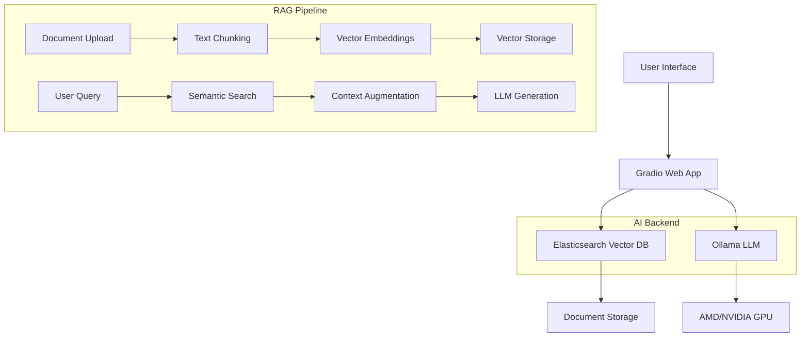

# 📚 Personal RAG Assistant

A powerful, self-hosted Retrieval-Augmented Generation (RAG) application that lets you chat with your personal documents using local AI. Built with GPU support for both AMD and NVIDIA systems.


## ✨ Features

- **🔍 Document Intelligence**: Upload and chat with your TXT files and Markdown documents
- **💬 Smart Conversations**: Context-aware chat using Retrieval-Augmented Generation (RAG)
- **⚡ Local & Private**: Everything runs on your machine - no data leaves your system
- **🎯 Multi-GPU Support**: Optimized for both AMD (ROCm) and NVIDIA (CUDA) GPUs
- **📊 Document Search**: Direct semantic search through your uploaded documents
- **🔧 Easy Setup**: Docker-based deployment with auto-detection for your hardware
- **📈 Real-time Streaming**: Watch responses generate token-by-token
- **🔍 Vector Search**: Semantic search powered by Elasticsearch's dense vector capabilities
- **Local Embedding Choices**: Keep Ollama by default or opt into an in-process CPU encoder
- **Context Budgeting**: Optional local history and retrieved-context compression for long chats

## 🏗️ Architecture


```mermaid
graph TB
    A[User Interface] --> B[Gradio Web App]
    B --> C[Elasticsearch Vector DB]
    B --> D[Ollama LLM]
    C --> E[Document Storage]
    D --> F[AMD/NVIDIA GPU]
    
    subgraph "RAG Pipeline"
        G[Document Upload] --> H[Text Chunking]
        H --> I[Vector Embeddings]
        I --> J[Vector Storage]
        K[User Query] --> L[Semantic Search]
        L --> M[Context Augmentation]
        M --> N[LLM Generation]
    end
    
    subgraph "AI Backend"
        C
        D
    end
```

## 📋 Prerequisites

- **Docker** and **Docker Compose**
- **GPU** (Optional but recommended):
  - AMD GPU with ROCm support (RX 6000+ series recommended)
  - NVIDIA GPU with CUDA support (GTX 10-series+ recommended)
  - CPU-only mode also supported

## 🚀 Quick Start

### 1. Clone the Repository
```bash
git clone https://github.com/KingAkeem/personal-rag.git
cd personal-rag
```

### 2. Auto-Detect Setup (Recommended)
```bash
# The script automatically detects your GPU and configures accordingly
./scripts/start.sh
```

### 3. Manual Setup (If you need specific control)
```bash
# For AMD GPUs
./scripts/start.sh amd

# For NVIDIA GPUs
./scripts/start.sh nvidia
```

### 4. Access the Application
- **Main App**: http://localhost:7860
- **Elasticsearch**: http://localhost:9200
- **Kibana** (Monitoring): http://localhost:5601
- **Ollama API**: http://localhost:11434

## 📁 Project Structure

```
personal-rag-assistant/
├── src/main.py                  # Main Gradio web interface
├── src/embeddings               # Configurable local embedding providers
├── src/context_compression.py   # Optional extractive context budgeting
├── src/storage                  # Vector database operations
├── src/llm                      # Local LLM chat and RAG functionality
├── benchmarks/run.py            # Local embedding/retrieval benchmark
├── docs/benchmarks.md           # Benchmark and metric guidance
├── docker-compose.amd.yml       # AMD GPU configuration
├── docker-compose.nvidia.yml    # NVIDIA GPU configuration
└── scripts                      # Setup, start, and stop utilities
```

## 🔧 Core Components

### Main Application (`main.py`)
- Gradio-based web interface with three tabs: Chat, Upload Documents, Document Search
- Real-time streaming responses
- Configurable context chunks (1-5)
- File upload support for .txt, .pdf, .md files

### Vector Storage (`elasticsearch`)
- Elasticsearch 8.13.0 with vector search capabilities
- Automatic text chunking with configurable overlap
- Cosine similarity search for semantic retrieval
- Document indexing and management

### LLM Integration (`llm`)
- Ollama integration with streaming support
- RAG pipeline with context augmentation
- Configurable chat models (default: llama2:7b)

### Embeddings (`embeddings`)
- Local embedding generation using Ollama `nomic-embed-text` by default
- Provider and model selection through environment variables
- Optional CPU-friendly `sentence-transformers/all-MiniLM-L6-v2` provider
- Index dimensions derived from the selected provider

## 💻 Usage

### 1. Upload Documents
- Go to the "Upload Documents" tab
- Upload your TXT or Markdown files
- Documents are automatically chunked and indexed for semantic search

### 2. Chat with Your Documents
- Switch to the "Chat" tab
- Ask questions about your uploaded content
- Adjust the "Context chunks" slider (1-5) to control how much context is used
- Watch responses stream in real-time

### 3. Search Documents
- Use the "Document Search" tab for direct semantic search
- Find relevant passages with similarity scores
- View results in JSON format with filename and content

## ⚙️ Configuration

### Environment Variables
The app can be configured using environment variables in the Docker Compose files:

```yaml
# Elasticsearch Configuration
ELASTICSEARCH_URL: "http://elasticsearch:9200"
ELASTICSEARCH_USERNAME: "elastic"
ELASTICSEARCH_PASSWORD: "changeme"

# Ollama Configuration
OLLAMA_HOST: "http://ollama:11434"

# Model Configuration
CHAT_MODEL: "llama2:7b"
EMBEDDING_PROVIDER: "ollama"
EMBEDDING_MODEL: "nomic-embed-text"
EMBEDDING_DIM: "768"
INDEX_NAME: "personal_documents"

# Optional context compression (disabled by default)
CONTEXT_COMPRESSION: "false"
```

### Model Customization
The current default remains Ollama with `nomic-embed-text`. To use the optional CPU encoder:

```bash
python3 -m venv .venv
source .venv/bin/activate
pip install -r requirements-cpu.txt

export EMBEDDING_PROVIDER=sentence-transformers
export EMBEDDING_MODEL=sentence-transformers/all-MiniLM-L6-v2
export EMBEDDING_DEVICE=cpu
export INDEX_NAME=personal_documents_minilm
python3 src/main.py
```

MiniLM produces 384-dimensional vectors. Use a new `INDEX_NAME` and re-ingest documents when changing provider, model, or vector dimension; Elasticsearch cannot mix dimensions in an existing index. The application reports a clear mismatch instead of indexing incompatible vectors.

For the Docker app, install the optional dependency at build time and pass the same environment values through Compose:

```bash
INSTALL_CPU_EMBEDDINGS=true \
EMBEDDING_PROVIDER=sentence-transformers \
EMBEDDING_MODEL=sentence-transformers/all-MiniLM-L6-v2 \
INDEX_NAME=personal_documents_minilm \
docker compose -f docker-compose.nvidia.yml up --build
```

### Optional Context Compression

Normal retrieval remains the default. For long chats, enable local extractive compression to include bounded recent history in retrieval and cap retrieved text before prompt construction:

```bash
export CONTEXT_COMPRESSION=true
export CONTEXT_COMPRESSION_HISTORY_CHARS=2000
export CONTEXT_COMPRESSION_CHUNK_CHARS=1200
export CONTEXT_COMPRESSION_MAX_CHARS=5000
```

This path performs deterministic whitespace compaction and truncation only. It does not send conversation history to another model or service.

### Local Benchmarks

Run the dependency-free benchmark smoke test:

```bash
PYTHONPATH=src python3 benchmarks/run.py --provider hash
```

For model-backed CPU, Ollama, compression, memory, latency, and retrieval-quality comparisons, see [Local embedding and compression benchmarks](docs/benchmarks.md).

## Local Validation

For a fast local check that does not require Elasticsearch, Ollama, a GPU, or
cloud credentials:

```bash
python3 -m venv .venv
source .venv/bin/activate
python -m pip install --upgrade pip
pip install -r requirements.txt
PYTHONPATH=src:. python -m unittest discover -s tests -v
python -m compileall -q src benchmarks tests
PYTHONPATH=src python benchmarks/run.py --provider hash --output /tmp/personal-rag-benchmark.json
docker compose -f docker-compose.nvidia.yml config
docker compose -f docker-compose.amd.yml config
```

Build the application image without optional CPU embedding dependencies:

```bash
docker build --build-arg INSTALL_CPU_EMBEDDINGS=false -t personal-rag:local .
```

To test the optional CPU embedding provider locally, install
`requirements-cpu.txt` in the same virtual environment and run the benchmark
with `--provider sentence-transformers`. This downloads the selected model to
your local machine.

## CI/CD

`.github/workflows/ci.yml` runs on pull requests, pushes to `main` or `master`,
and manual dispatch. It installs Python 3.11 dependencies, runs unit tests,
compiles the Python sources, runs the dependency-free benchmark smoke test,
uploads the benchmark JSON artifact, validates both Docker Compose files, and
builds the application image.

## 🐛 Troubleshooting

### Common Issues

**GPU Not Detected**
```bash
# Check GPU detection
./scripts/start.sh --debug

# Force CPU mode
./scripts/start.sh amd  # Uses CPU-only fallback
```

**Ollama Model Fails to Load**
```bash
# Check available models
docker exec ollama ollama list

# Pull model manually
docker exec ollama ollama pull llama2:7b
```

**Elasticsearch Health Issues**
```bash
# Check Elasticsearch status
curl -u elastic:changeme http://localhost:9200/_cluster/health

# View Elasticsearch logs
docker logs elasticsearch -f
```

**Port Conflicts**
```bash
# Check what's using the ports
sudo lsof -i :7860  # Gradio app
sudo lsof -i :9200  # Elasticsearch
sudo lsof -i :5601  # Kibana
sudo lsof -i :11434 # Ollama
```

### Logs and Monitoring

```bash
# View all service logs
docker compose -f docker-compose.amd.yml logs -f

# View specific service logs
docker logs rag-app -f
docker logs ollama -f
docker logs elasticsearch -f

# Check service health
docker ps
docker stats
```

## 🔒 Security Notes

- Default passwords are set to `changeme` - **change these in production**
- Elasticsearch security is enabled by default
- The application runs locally by default (server_name="0.0.0.0")
- Consider using HTTPS and reverse proxy for external access
- Regularly update Docker images to latest versions

## 🚀 Performance Tips

### For Better GPU Utilization
- Adjust `HSA_OVERRIDE_GFX_VERSION` in AMD configuration for your specific GPU
- Modify `OLLAMA_GPU_LAYERS` in NVIDIA configuration based on VRAM
- Monitor GPU usage with `rocm-smi` (AMD) or `nvidia-smi` (NVIDIA)

### For Large Document Collections
- Increase Elasticsearch heap size in `ES_JAVA_OPTS`
- Adjust chunk size and overlap in `storage.py`
- Monitor disk space for vector storage

### Areas for Contribution
- Additional file format support (DOCX)
- Enhanced UI/UX improvements
- More embedding model options
- Performance optimizations
- Additional vector database support

## 🙏 Acknowledgments

- [Gradio](https://gradio.app/) for the excellent web interface framework
- [Ollama](https://ollama.ai/) for making local LLMs accessible
- [Elasticsearch](https://elastic.co/) for vector search capabilities
- The open-source AI community for continuous inspiration

---

**⭐ If this project helped you, please give it a star on GitHub!**

---
